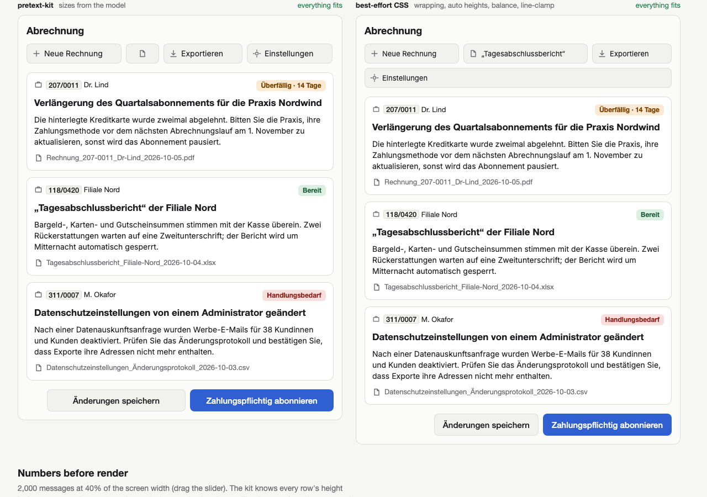
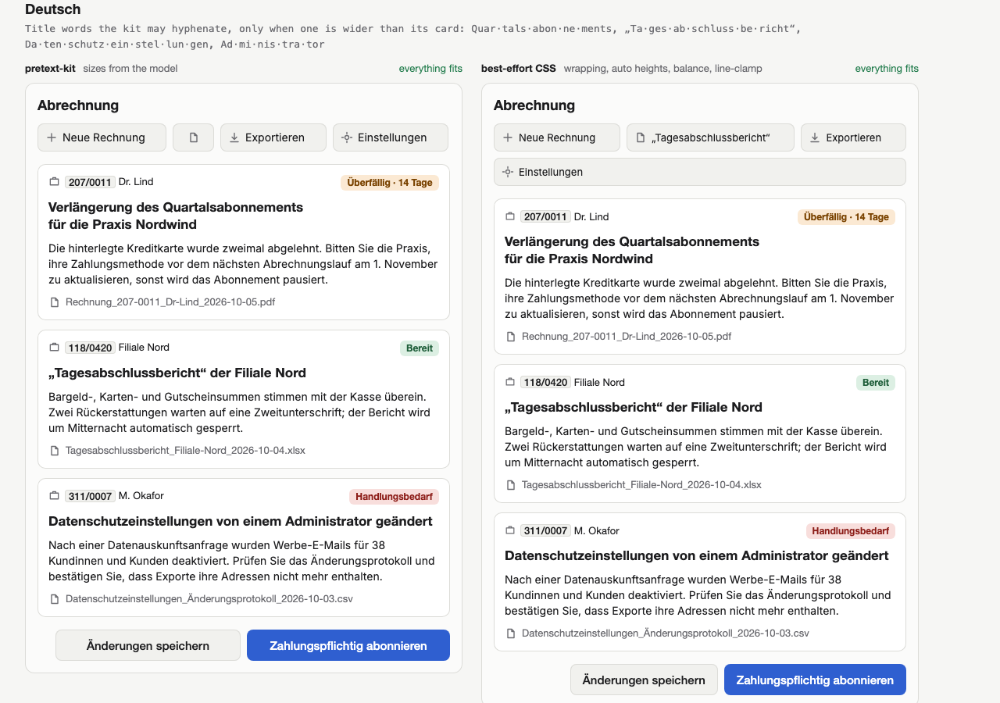
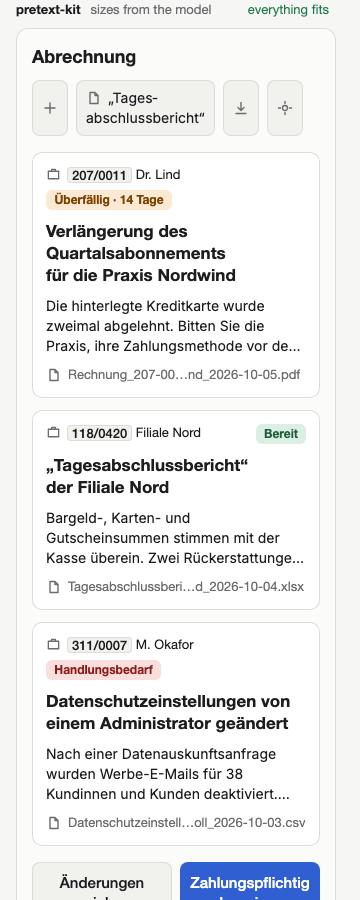
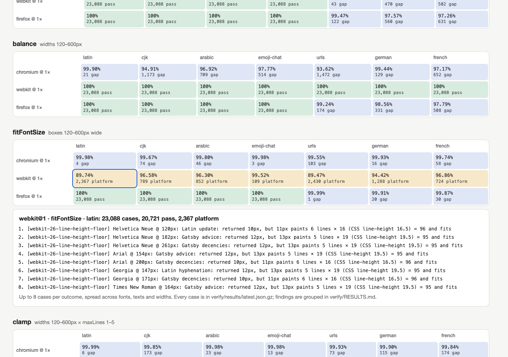
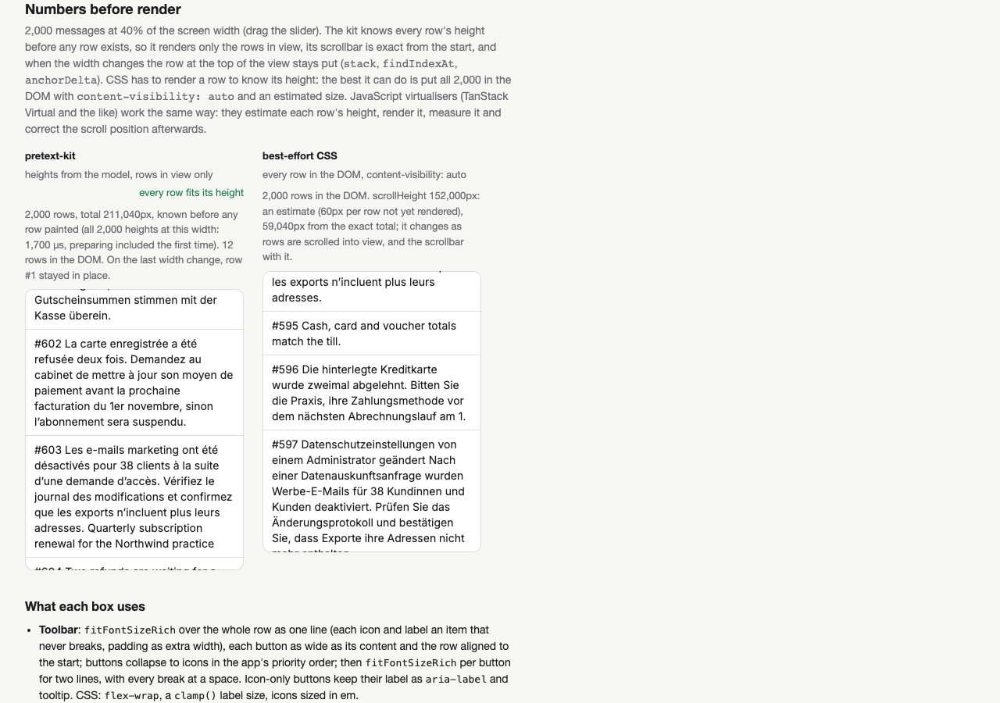
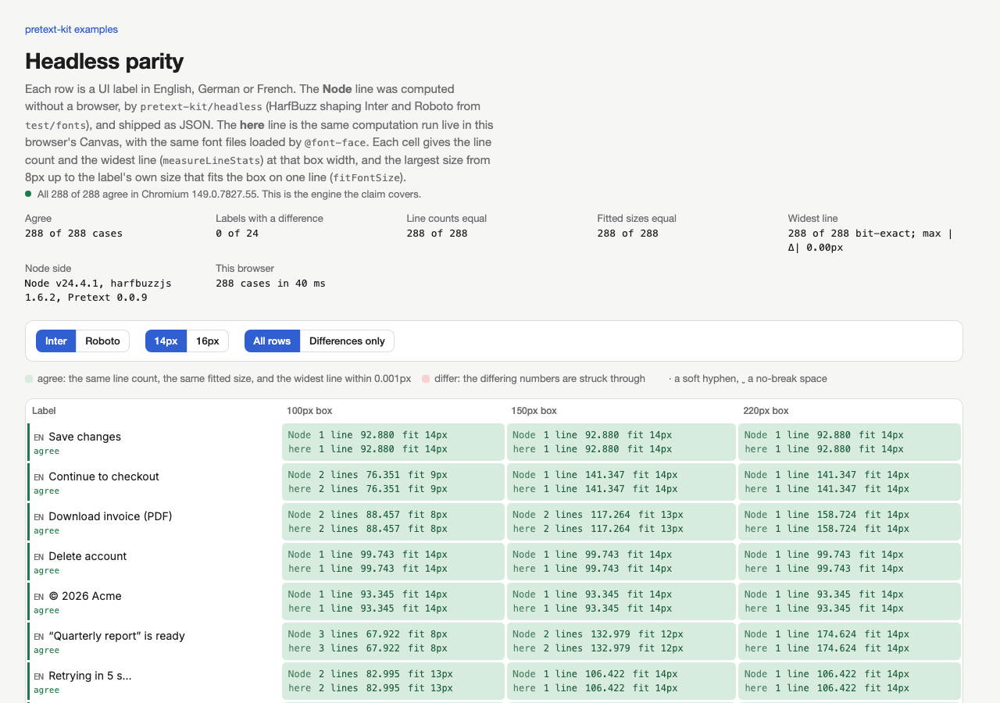

# pretext-kit

Exact text-sizing helpers for web UIs, built on [Pretext](https://github.com/chenglou/pretext), in the browser and,
with no browser, in Node. pretext-kit is not part of Pretext and is not maintained by its authors; it calls Pretext's
public API and adds the answers apps keep re-deriving on top of it: the font size that fits a box, the width that
balances lines, clamped and middle-cut text, list heights. `shrinkwrap`, `balance`, `fitFontSize`,
`fitFontSizeRich`, `clamp`, `truncateMiddle` and `fontFromStyle` are checked against what Chromium, WebKit and Firefox
actually paint ([verify/RESULTS.md](verify/RESULTS.md)); `shrinkwrapRich`, `balanceRich`, `watchFonts` and the list
helpers (`stack`, `findIndexAt`, `anchorDelta`) are unit-tested only. [EVALUATION.md](EVALUATION.md) states the
claims, the confidence bounds, the threats to validity and the known limitations.

- **`pretext-kit/headless`**: Pretext and every helper in Node, vitest, jest (jsdom too) and CI, shaping your own
  font files with HarfBuzz, so "does „Zahlungspflichtig abonnieren“ fit this button at 160px?" becomes a unit test.
  Against Chromium on macOS with the same font files: every Inter and Roboto width bit-exact, and of 71,818 line
  counts none differing from Pretext inside Chromium. Registered fonts and Chromium's rules only
  ([the claim and its limits](#the-claim-and-its-limits)).

What it adds that CSS can't do:

- **`fitFontSize` / `fitFontSizeRich`**: the largest whole-pixel size at which a label, or an icon and a label
  together, fits a box: on one line, in N lines, or in a height; and so one shared size for a whole toolbar or
  button row. CSS has no exact equivalent.
- **`truncateMiddle`**: `~/Projects/atlas/…/line-breaker.test.ts`, keeping as much of each end as fits, for any
  string. CSS can cut the middle only where you already know the split point.
- **Numbers before render**: heights, widths and line counts for text that isn't in the DOM yet (virtual lists,
  canvas, layout decided ahead of paint).



*The [examples](#examples): one screen laid out by the kit (left) and by best-effort CSS (right). Good CSS doesn't
overflow either; the kit decides things CSS can't. Here the toolbar stays on one row: tighter padding first, then
icon-only buttons in the app's priority order (settings first; the daily closing report, the screen's subject,
keeps its label).*

## Install

pretext-kit is not on npm yet. Each [GitHub release](https://github.com/Z003Y89/pretext-kit/releases) carries two
tarballs, installed by URL with no npm account or registry publish involved: the kit, and the Pretext it needs.

```sh
npm install https://github.com/Z003Y89/pretext-kit/releases/download/v0.1.1/chenglou-pretext-0.0.10-main.f10d888.tgz https://github.com/Z003Y89/pretext-kit/releases/download/v0.1.1/pretext-kit-0.1.1.tgz
npm i -D harfbuzzjs@1.6.2 wawoff2@2.0.1   # only for pretext-kit/headless (optional peers; wawoff2 for WOFF2 fonts)
```

**The Pretext tarball is an unofficial, labelled snapshot, not a release by Pretext's authors.** The kit needs Pretext
from `main` at [f10d888](https://github.com/chenglou/pretext/commit/f10d888c0f3dfc5877fbca5e4570ee04111e7001)
(2026-10-05), since npm's `@chenglou/pretext` 0.0.9 predates the per-engine line breakers the kit is verified
against, and Pretext has not released since. `chenglou-pretext-0.0.10-main.f10d888.tgz` is that commit, unmodified,
built with Pretext's pinned TypeScript; only its `package.json` differs: version `0.0.10-main.f10d888`, a description
saying it is an unofficial snapshot, and no install or pack scripts. Its LICENSE (MIT) and README are Pretext's.
`verify/pack-release.sh` rebuilds both tarballs from the two repositories, and `verify/consumer-smoke.mjs` installs
them into a fresh project and runs the kit there (CI does both on every push). When Pretext publishes 0.0.10, install
it from npm instead and drop the snapshot.

Or build from source, the route the evaluation used:

```sh
# Pretext's build is tsc alone; its other dev dependencies float (no npm lockfile) and, on 2026-10-05, no longer
# resolve with `npm install` (oxlint peer conflict), so build with its pinned TypeScript directly:
git clone https://github.com/chenglou/pretext && (cd pretext && git checkout f10d888 && npx -y -p typescript@6.0.2 tsc -p tsconfig.build.json)
git clone https://github.com/Z003Y89/pretext-kit && (cd pretext-kit && npm install && npm run build)
npm install ./pretext ./pretext-kit
npm i -D harfbuzzjs@1.6.2 wawoff2@2.0.1   # only for pretext-kit/headless (optional peers; wawoff2 for WOFF2 fonts)
```

`@chenglou/pretext` is a peer dependency: your app and the kit share one Pretext, and one cache. Its range is
`>=0.0.10-0 <0.0.11`: Pretext is pre-1.0, so each 0.0.x release may change what the kit is verified against, and 0.0.10
is the first release with the line breakers above. The `-0` admits 0.0.10's prereleases, so the labelled snapshot
`0.0.10-main.f10d888` satisfies it, as will a future 0.0.10, while npm's stale 0.0.9 does not. (A build from `main`
still says 0.0.9, which npm does not check for the folder installs above.) The optional peers are `harfbuzzjs`
`^1.6.2` and `wawoff2` `^2.0.1` (1.6.2 and 2.0.1 are the versions verified). The package declares Node `>=22`: CI
runs the tests on Node 22 and 24 on Linux, Windows and macOS, and the consumer smoke test on Node 22 and 24. Running
the repository's own TypeScript tests needs Node 22.18 or later, where type stripping is on by default.

## When CSS is enough

| Helper | Plain-CSS alternative | When CSS suffices | When you need the kit |
|---|---|---|---|
| `balance` | `text-wrap: balance` (Chrome 114, Safari 17.5, Firefox 121) | Displaying a headline with even lines; engines balance only short blocks (each caps the line count it will balance) | You need the width as a number (canvas, SVG, layout decided before render), or longer blocks, or older engines |
| `clamp` | `-webkit-line-clamp` (all three engines; the unprefixed `line-clamp` isn't everywhere yet, so ship both) | Displaying "3 lines then …" | You need the cut text itself, or the clamped height before render (virtual lists, cards) |
| `shrinkwrap` | none for multi-line (`fit-content` stays at the full width once text wraps) | Single-line bubbles | Multi-line bubbles and tooltips that hug their text |
| `truncateMiddle` | two spans in a flex row: the start with `min-width: 0; overflow: hidden; text-overflow: ellipsis`, the end `flex: none` | The split point is known (the extension, a date after the last `_`) and the end always fits | Any string, where the cut should keep as much of each end as fits, measured |
| `fitFontSize(Rich)` | none exact; fluid `clamp()` and container units only approximate | When "about right" is fine, or wrapping the row is acceptable | Labels, badges and buttons that must fit, one shared size per row, in every language and text size |
| `pretext-kit/headless` | a real browser in CI (Playwright) | You already run one, or your fonts aren't files you can register | Unit tests and servers without a browser, for registered fonts on Chromium's rules |

## When to measure with the DOM instead

For a handful of labels on screen, measure them in the DOM: the browser already knows exactly, icons and padding
included, and nothing can disagree with it. The kit pays off when there are many texts, when the answer is needed
on every resize frame, or before the text exists in the DOM at all (virtual lists, layout computed ahead of render,
server or test code).

## Helpers

Each helper takes Pretext's prepared handles, so the expensive part (measuring text) happens once and each resize is
arithmetic. Fonts are Canvas font strings, e.g. from [`fontFromStyle`](#fonts).

```ts
import { prepareWithSegments } from '@chenglou/pretext'
import {
  shrinkwrap, balance, clamp, measureTail, prepareLabel, truncateMiddle, prepareSizes, fitFontSize,
} from 'pretext-kit'

const font = '15px "Helvetica Neue"'
const p = prepareWithSegments('Ship the release notes before the freeze on Friday', font)

shrinkwrap(p, 320)          // { width, lineCount }: the width that paints the same lines with no slack
balance(p, 320)             // { width, lineCount }: the narrowest width that keeps the line count

const tail = measureTail('…', font)          // once per font
clamp(p, 240, 2, tail)                       // { truncated, lineCount, lines: [{ text, width }] }

const label = prepareLabel('~/Projects/atlas/src/core/line-breaker.test.ts', font)
truncateMiddle(label, 220, { from: label.text.lastIndexOf('/') })   // a start, '…', then '/line-breaker.test.ts' whole

const sizes = prepareSizes('Zahlungspflichtig abonnieren', px => `500 ${px}px "Helvetica Neue"`, { min: 11, max: 16 })
fitFontSize(sizes, { width: 180, maxLines: 1 }, px => Math.round(px * 1.3))   // { px, prepared, lineCount } | null
```

- `shrinkwrapRich` / `balanceRich` take a `PreparedRichInline` (mixed fonts, chips, icons).
- `maxWidth` for `shrinkwrap`, `balance` and their rich forms is a number of CSS px, at least 0, or `Infinity` for
  unbounded; a negative or NaN `maxWidth` throws a `RangeError` (Pretext would lay NaN out as unbounded and a negative
  width as narrower than any grapheme, and the answer would be NaN or negative). The answer never exceeds `maxWidth`.
- `clampStats(p, width, maxLines)` gives `{ truncated, lineCount }` without building lines: all a list needs for
  rows it doesn't paint. In both, `maxLines` is a whole number of at least 1; anything else throws a `RangeError`.
- `prepareLabel(text, font).text` is the label as Pretext prepared it, white space collapsed as CSS's `white-space:
  normal` does (runs of spaces, tabs and line breaks become one space, none at either end). `truncateMiddle` cuts and
  returns that text, and `keepEnd.from` is an index into it: write `label.text.lastIndexOf('/')`, not an index into the
  string you passed, which differs wherever white space collapsed.
- `prepareSizesRich(px => items, range)` / `fitFontSizeRich` fit an icon and a label as one row; see
  [Mixed rows](#mixed-rows).
- `stack(heights, gap, tops)`, `findIndexAt(tops, count, y)`, `anchorDelta(oldTops, newTops, anchor)` are the three
  pieces of a virtual list; see [Recipes](#recipes).
- `fontFromStyle(getComputedStyle(el))` and `watchFonts(onChange)`: see [Fonts](#fonts).

The browser reproduces every answer: a helper returns a width, a font size, a line count or the cut text of a line,
and the browser's own wrapping at that value paints the predicted lines.

## What's exact

`npm run verify` sweeps `shrinkwrap`, `balance`, `fitFontSize`, `fitFontSizeRich`, `clamp`, `truncateMiddle` and
`fontFromStyle` in Chromium, WebKit and Firefox (Playwright 1.61.0, macOS), at
deviceScaleFactor 1, 1.25 and 2, over Latin, CJK, Arabic, emoji chat, URLs, soft-hyphenated German and French, and
file paths, in four named fonts, at every width from 120 to 600px (80–400px for `truncateMiddle`; every fourth
width at 1.25 and 2). Each case is judged against Pretext's own numbers
first, then against the painted DOM. `shrinkwrapRich`, `balanceRich`, `watchFonts`, `stack`, `findIndexAt` and
`anchorDelta` are not swept: they are covered by `npm test` on a stand-in Canvas only. The recorded run has
**zero kit-mismatch cases** in every browser at every
factor. The remaining non-pass cases are where Pretext itself differs from the browser (`pretext-gap`), or a proven
browser quirk (`platform`: WebKit 26 floors fractional line heights); none is patched in the kit. Builds, counts and
every finding grouped by cause: [verify/RESULTS.md](verify/RESULTS.md). The [accuracy example](#examples) shows them
as a grid. [EVALUATION.md](EVALUATION.md) gives each helper's claim as a falsifiable property, 95% upper bounds on
the mismatch rate, mutation tests of the sweep itself, the threats to validity, and the known limitations (among
them soft-hyphenated text that overflows a fitted box in Chromium and Firefox where Pretext places the break
differently, and macOS as the only platform measured).

## Fonts

- Bundle your app's font with `@font-face`, and `await document.fonts.load(font)` before preparing; text prepared
  before a font loads is measured in the fallback.
- Read fonts from CSS rather than writing them twice: `fontFromStyle(getComputedStyle(el))` returns
  `{ font, letterSpacing, lineHeight }`. It throws on `line-height: normal` (set a number) and on `font-variant`
  values Canvas can't express.
- After a late font, `watchFonts(() => { /* prepare again, lay out again */ })` calls Pretext's `clearCache()` on
  each `loadingdone` and then your callback. Prepared handles keep the old widths, so prepare again inside it.
- Use named fonts. Never `system-ui` or `-apple-system` on macOS: see
  [Pretext's caveats](https://github.com/chenglou/pretext#caveats).
- `font-feature-settings` and `font-variant-numeric` (tabular figures and the like) aren't supported: the Canvas font
  string can't express them, so Pretext measures the default glyphs.

## Hyphenation

Browsers' `hyphens: auto` dictionaries differ per engine, so no measurer can know where they break. Put soft
hyphens (U+00AD) in once, measure that string, and paint the same string with `hyphens: manual`. Hyphenate only
where it's needed: a label or button can usually reflow or take a shared size instead, and a title needs soft
hyphens only in a word wider than its box, which the kit can measure:

```ts
import { measureNaturalWidth, prepareWithSegments } from '@chenglou/pretext'
import { balance } from 'pretext-kit'
import de from 'hyphen/de/index.js'   // TeX patterns (de-1996), the hyphen package

const title = 'Datenschutzeinstellungen geändert'
const hyphenated = de.hyphenateSync(title).split(' ')   // 'Da\u00ADten\u00ADschutz…'
const text = title.split(' ')
  .map((w, i) => measureNaturalWidth(prepareWithSegments(w, font)) > boxWidth ? hyphenated[i] : w)
  .join(' ')
const { width, lineCount } = balance(prepareWithSegments(text, font), boxWidth)
// paint `text`, soft hyphens included, at `width` with `hyphens: manual`
```

For UI labels, author the soft hyphens yourself at compound joints (`'Tages\u00ADabschluss\u00ADbericht'`):
dictionaries pick syllable breaks (Tagesab-schlussbericht) that a German reader finds wrong in a button. Use
`hyphen/de` for running text and titles.

The sweep's German and French corpora are hyphenated throughout and run through every swept helper: zero kit-mismatch
in all three browsers. Their pretext-gaps are under 0.5% of the German cases and under 1% of the French ones in
every browser and zoom factor (WebKit also has line-height `platform` cases, which are safe). See
[RESULTS.md](verify/RESULTS.md) for the per-browser counts. Pretext's README
also recommends conservative insertion for app text.

## Zoom and scale

- **Browser and Electron zoom need no correction.** Zoom changes device pixels per CSS px, not CSS px. The sweep
  ran at Playwright deviceScaleFactor 1, 1.25 and 2 with zero kit-mismatch at each, and identical counts at 1.25 and
  2 (both at a 4px width step; see [RESULTS.md](verify/RESULTS.md)). Caveat: that is emulation on macOS, not proof
  that Windows (DirectWrite) or Linux (FreeType hinting) measure alike, nor exactly what page zoom does to the
  layout viewport.
- **A text-size setting is a different font size**, so it needs its own prepared text: `prepareSizes` keeps one
  handle per size it has visited, and `fitFontSize` searches the scaled range.
- Sizes are whole pixels (Firefox measures Canvas text at rounded sizes). For exact fits in Safari 26, use
  whole-pixel line heights.

## Mixed rows

An icon, a case-number chip and a name, as one row:

```ts
import { prepareRichInline } from '@chenglou/pretext/rich-inline'
import { shrinkwrapRich } from 'pretext-kit'

const font = '13px "Helvetica Neue"'
const row = prepareRichInline([
  { width: 16 },                                                      // the icon's margin box
  { text: '207/0011', font, break: 'never', extraWidth: 12 },         // a chip: padding and border
  { text: ' Dr. Lind', font },                                        // the space before it collapses as in CSS
])
shrinkwrapRich(row, 240)   // { width, lineCount }
```

Give each box `vertical-align: top` and keep it no taller than the line. `fitFontSizeRich` takes the same items as a
function of the font size, so icon, chip and text scale together.

## Recipes

These are app code, not library features.

**A React virtual list.** Prepare once per text, recompute heights on width change, render only the visible rows,
and move `scrollTop` only when layout moved the row the reader is looking at.

```tsx
import { useLayoutEffect, useMemo, useRef, useState } from 'react'
import { layout, prepare } from '@chenglou/pretext'
import { anchorDelta, findIndexAt, stack } from 'pretext-kit'

const PAD = 12, GAP = 8

function Messages({ texts, font, lineHeight, width, height }: {
  texts: string[], font: string, lineHeight: number, width: number, height: number
}) {
  const prepared = useMemo(() => texts.map(t => prepare(t, font)), [texts, font])
  const { tops, total } = useMemo(() => {
    const heights = prepared.map(p => layout(p, width - 2 * PAD, lineHeight).height + 2 * PAD)
    const tops = new Float64Array(heights.length)
    return { tops, total: stack(heights, GAP, tops) }
  }, [prepared, width, lineHeight])

  const scroller = useRef<HTMLDivElement>(null)
  const [scrollTop, setScrollTop] = useState(0)
  const anchor = useRef<{ tops: Float64Array, row: number } | null>(null)
  useLayoutEffect(() => {
    const a = anchor.current
    if (a !== null && a.tops.length === tops.length) {
      const d = anchorDelta(a.tops, tops, a.row)
      if (d !== 0) scroller.current!.scrollTop += d
    }
    anchor.current = { tops, row: findIndexAt(tops, tops.length, scroller.current!.scrollTop) }
  }, [tops])

  const start = findIndexAt(tops, tops.length, scrollTop)
  const end = findIndexAt(tops, tops.length, scrollTop + height) + 1
  return (
    <div ref={scroller} style={{ height, overflowY: 'auto' }} onScroll={e => {
      const y = e.currentTarget.scrollTop
      setScrollTop(y)
      anchor.current = { tops, row: findIndexAt(tops, tops.length, y) }
    }}>
      <div style={{ position: 'relative', height: total }}>
        {texts.slice(start, end).map((t, k) => (
          <p key={start + k} style={{ position: 'absolute', top: tops[start + k], width, padding: PAD, margin: 0, font, lineHeight: `${lineHeight}px` }}>{t}</p>
        ))}
      </div>
    </div>
  )
}
```

**The visible window of a virtual list**, on its own:

```ts
const start = findIndexAt(tops, n, scrollTop)
const end = findIndexAt(tops, n, scrollTop + viewportHeight) + 1   // exclusive
```

**A calendar block** shows the most it can: title and time, else the title, else the time, else "…".

```ts
const maxLines = Math.floor(blockHeight / lineHeight)
const tail = measureTail('…', font)
function blockText(title: string, time: string): string[] {
  if (maxLines < 1) return []
  for (const text of [`${title} · ${time}`, title, time]) {
    const c = clamp(prepareWithSegments(text, font), blockWidth, maxLines, tail)
    if (!c.truncated) return c.lines.map(l => l.text)
  }
  return ['…']
}
```

**A German label check** (in a test, or before choosing a layout):

```ts
const fits = measureLineStats(prepareWithSegments('Zahlungspflichtig abonnieren', font), buttonContentWidth).lineCount === 1
```

**A card row's height** before render: each paragraph's `layout().height`, plus fixed boxes and padding, and the
tallest card wins.

```ts
const cardHeight = (c: Card) => PAD * 2 + c.paragraphs.reduce((h, p) => h + layout(p, contentWidth, LH).height, 0) + c.fixedBoxes
const rowHeight = Math.max(...row.map(cardHeight))
```

## Examples

`npm run examples` builds them into `examples/dist`; `npm run examples:serve` serves them on
http://localhost:4173. They cover only what the kit adds (Pretext's own demos show bubbles, ellipsis and a chat list),
each beside the same UI in best-effort CSS (wrapping rows, auto heights, `text-wrap: balance`, `line-clamp`, a
two-span middle cut, `clamp()` sizes), with live sizes and timings, in light and dark. Each page says which boxes
CSS handles equally well (titles, bodies, row heights):

- **Responsive UI**: a billing screen from 320 to 1440px: a toolbar and button pair in one shared size
  (`fitFontSizeRich`, content widths, then tighter padding, then icon-only buttons in the app's priority order, then
  two lines broken at spaces; on a phone, only the report keeps its label, on two lines at a space or else at a
  compound joint written into the string),
  badges that fit (`fitFontSize`, `shrinkwrap`), file names cut in the middle with no split point
  (`truncateMiddle`), and a 2,000-row list with exact heights and a scroll anchor (`stack`, `findIndexAt`,
  `anchorDelta`) beside CSS `content-visibility: auto`.
- **Text size**: an app-wide text-size setting from 0.8× to 1.5×. The kit reflows first and shrinks text by at
  most 10% (cf. WCAG 1.4.4).
- **Languages**: English, German and French; labels break only at hand-written compound joints and only when a
  word is wider than the room, soft hyphens from TeX patterns only in a title word wider than its card.
- **Accuracy**: the sweep as a browser × zoom × helper × corpus grid with sample cases
  (`npm run examples:data` re-exports it from `verify/`).
- **Headless parity**: 24 English, German and French UI labels at three widths and two sizes,
  computed in Node by `pretext-kit/headless` (`examples/build-headless-parity.ts`, Inter and Roboto from
  `test/fonts`) beside the same numbers computed live in the browser from the same font files: line count, widest
  line and the `fitFontSize` for a button, row by row, with the browser's name and an agreement count.

Fonts come from `fontFromStyle(getComputedStyle(el))`; the local server sends Inter 1.5 s late so `watchFonts`
visibly lays the page out again. `npm run examples:check` loads every page in headless Chromium at 360, 768 and
1280px (`npm run examples:screenshots` also rewrites `examples/screenshots/`) and fails on a console error or on a kit-side box that overflows for any reason other than a pretext-gap
(a paragraph the browser wraps differently from Pretext's own layout of it). In its last run neither side
overflowed anywhere; best-effort CSS wrapped the toolbar onto a second row in 8 of 21 settings at 1280px and in
every setting at 360px. It also fails unless every headless-parity case matches in Chromium, line count, fitted size and width
(288 of 288 in its last run, Chromium 149 on macOS, widths bit-exact), and reports WebKit and Firefox without
judging them, as they are outside the claim: WebKit 26.5 agrees in line count and fitted size in 287 of 288 (one
fitted size differs; 275 widths bit-exact), Firefox 151 in 288 of 288 (its Canvas widths differ from Chromium's in
every case, median 0.024px, max 3.09px).

| | |
|---|---|
|  |  |
|  |  |
|  |  |

## Versions

pretext-kit is built and verified against Pretext `main` at
[f10d888](https://github.com/chenglou/pretext/commit/f10d888c0f3dfc5877fbca5e4570ee04111e7001); pin that commit until
Pretext's next release. It uses only Pretext's public exports: `prepareWithSegments`, `layout`, `layoutNextLine`,
`layoutNextLineRange`, `layoutWithLines`, `measureLineStats`, `measureNaturalWidth` and `clearCache`, and from
`@chenglou/pretext/rich-inline`, `prepareRichInline` and `measureRichInlineStats`. Of a prepared handle's fields it
reads only the documented `segments`.

## Headless (Node, vitest, jest, CI)

`pretext-kit/headless` is a test-time and server-time `OffscreenCanvas` for Pretext, backed by HarfBuzz shaping your own
font files. Pretext and every pretext-kit helper then run in Node, Bun, vitest and jest (including jsdom) with no
browser, so "does „Zahlungspflichtig abonnieren“ fit this button at 160px?" becomes a unit test.

```sh
npm i -D harfbuzzjs@1.6.2 wawoff2@2.0.1   # optional peers, loaded only by pretext-kit/headless (wawoff2: WOFF2 fonts)
```

wawoff2 is loaded only when a WOFF2 font is registered; without it, the entry loads and TTF, OTF, TTC and WOFF fonts
register, and registering a WOFF2 rejects with an error naming the package.

```ts
import { readFileSync } from 'node:fs'
import { measureLineStats, prepareWithSegments } from '@chenglou/pretext'
import { registerFont, install } from 'pretext-kit/headless'

// The same files your CSS @font-face loads, under the same family names. TTF/OTF/TTC, WOFF or WOFF2.
// Register each weight you measure: '600 14px Inter' needs the 600 file, registered with { weight: 600 }.
await registerFont('Inter', new Uint8Array(readFileSync('fonts/Inter-Regular.ttf')))
install()

// Before the first prepare(): a static import of Pretext above is fine, as Pretext reads the engine only then.
const { lineCount } = measureLineStats(prepareWithSegments('Speichern', '14px Inter'), 160)
```

A runnable version is `examples/vitest-label-fit.test.ts`.

### The claim and its limits

On macOS Chrome, for code points covered by the registered fonts, `measureText` widths equal Chrome's Canvas, and
Pretext's line counts equal Chrome's page wherever Pretext inside Chrome does. Measured twice:

- **Parity sweep** (`npm run verify:headless`, [verify/HEADLESS_RESULTS.md](verify/HEADLESS_RESULTS.md)), Chromium
  149.0.7827.55 via Playwright 1.61.0 on macOS 14.6.1, fonts loaded by `@font-face` from the same files: 4,992 widths
  (Inter TTF and WOFF2, Roboto, Shantell Sans; weights 400/600/700, 12-20px, letter spacing 0/0.5px), 3,842 bit-exact
  (all Inter and Roboto ones), max 0.000427px; 71,818 line counts (Latin, German with soft hyphens, French, quoted,
  pictographic and separator texts at 120-600px), 0 differing from Pretext inside Chromium.
- **Initial research**, Chrome 154: 320/352 widths bit-exact, max 0.019px; line counts 2,021/2,024.

The sweep launches Chromium headed, as users see it. `npm run verify:headless -- --headless` uses Playwright's
headless Chromium instead, for machines with no display, and says so in HEADLESS_RESULTS.md: on the Mac above it gave
the same widths and 0 headless-mismatch, but 179 pretext-gaps rather than 176, as headless Chromium's page wraps three
more lines differently (so CI runs headed, under xvfb on Linux).

The claim is scoped exactly so:

- **Registered fonts only.** A code point no registered font covers makes `measureText` throw a `HeadlessCoverageError`
  naming the character and the font list (Chrome would use an OS fallback font we can't reproduce). An opt-in
  `install({ onMissingGlyph: 'notdef' })` measures `.notdef` instead, for apps that accept the error. Curly and German
  quotes and the ellipsis work with Latin fonts: Pretext's Han-kerning probe of U+300C gets a stand-in width (it has no
  effect on text without CJK), but real CJK text in a font lacking it still throws. Inherent case: a lone `「` or `「「`
  segment in such a font measures that stand-in rather than throwing, as the probe is the same `measureText` call.
  Likewise Pretext's emoji correction probes U+1F600 for any Extended_Pictographic text (`©`, `®`, `™`, `↔`, `▶`, `♥`, `‼`), which
  gets a stand-in of exactly the font size (plus any letter spacing, as the U+300C stand-in gets); any other uncovered emoji, and U+1F600 inside a longer segment, still throws,
  and a standalone `😀` segment in a font lacking it measures that stand-in rather than throwing. A symbol your font
  lacks (Inter has no `✔`) throws for that glyph.
- **small-caps.** A `small-caps` font (which `fontFromStyle` emits for `font-variant: small-caps`) throws when it is
  set on the context: Canvas widths change with small capitals, and the stand-in does not model them.
- **Weights.** A weight with no matching registered face (600 or 700 with only a Regular file) silently measures the
  nearest registered face, so register the bold file your CSS uses, with `{ weight: 700 }`.
- **Chromium profile.** `install()` sets a desktop Chrome user agent, which Pretext reads at the first `prepare()`,
  so Pretext uses its Blink rules. WebKit and Gecko profiles are not supported.
- **Platforms.** Parity is claimed for macOS Chrome only. Since 0.1.1, CI measures it on Linux (FreeType; whole-px
  advances without subpixel positioning) and Windows (DirectWrite) too: the `parity` job runs the same sweep, headed,
  on `ubuntu-latest` (under xvfb) and `windows-latest` with Node 24, and uploads each run's HEADLESS_RESULTS.md as the
  artifact `headless-results-<os>`. A headless-mismatch there is recorded, not treated as a CI failure.
  **[PLACEHOLDER, to be filled from the first CI run: the Linux and Windows widths (cases, exact, max |Δ|) and line
  counts (headless-mismatch, pretext-gap), and whether either platform is now claimed.]** Until a platform is
  claimed, treat it as unmeasured; if Linux's results show Chrome rounds, `install({ rounding: 'whole-px' })` is the
  mode for it.

### Install order

`install()` must run before the first `prepare()`: Pretext fixes its engine profile and canvas on first use, not on
import. The order is documented, not detected. Static imports are fine: register fonts and call `install()` at the top
of the test file or in a setup file (vitest `setupFiles`, jest `setupFilesAfterEnv`). Import Pretext dynamically only when jsdom
globals must exist before it loads (below). `install()` throws if another `OffscreenCanvas` is already set.

vitest (`vitest.setup.ts` in `setupFiles`, then ordinary tests):

```ts
import { readFileSync } from 'node:fs'
import { registerFont, install } from 'pretext-kit/headless'
await registerFont('Inter', new Uint8Array(readFileSync('fonts/Inter-Regular.ttf')))
install()
```
```ts
import { it, expect } from 'vitest'
import { measureLineStats, prepareWithSegments } from '@chenglou/pretext'
it('fits one line at 160px', () => {
  const { lineCount } = measureLineStats(prepareWithSegments('Speichern', '14px Inter'), 160)
  expect(lineCount).toBe(1)
})
```

jest + jsdom. pretext-kit and Pretext are ESM only (no `require` condition), so use jest's ESM mode:
`NODE_OPTIONS=--experimental-vm-modules npx jest` (with `jest-environment-jsdom` installed).

```js
// jest.config.mjs
export default { transform: {}, testEnvironment: 'jsdom', setupFilesAfterEnv: ['./jest.setup.mjs'] }
```
```js
// jest.setup.mjs: runs inside the jsdom environment before each test file, so `document` already exists
import { readFileSync } from 'node:fs'
import { TextDecoder, TextEncoder } from 'node:util'

// jest-environment-jsdom has no TextDecoder/TextEncoder, which harfbuzzjs needs when it loads,
// so set them first and import the headless module dynamically after.
Object.assign(globalThis, { TextDecoder, TextEncoder })
const { registerFont, install } = await import('pretext-kit/headless')
await registerFont('Inter', new Uint8Array(readFileSync('fonts/Inter-Regular.ttf')))
install()
```

Verified by running jest 30 with `jest-environment-jsdom` on a copy of this repo (a test with `document.body` present
measured `'Speichern © 2026'` at 600 14px Inter, with only the Regular file registered and so measured in it, in one line at 160px).

### jsdom

jsdom has a `document.body`, but its `getBoundingClientRect` returns zeros. Pretext corrects Canvas emoji widths
against a DOM span (only when Canvas's emoji width exceeds the font size by more than 0.5px); under jsdom the span
measures 0, so that correction would zero every emoji it applies to. What the stand-in guarantees: Pretext's probe
string U+1F600 measures exactly the font size where no registered font has it, so the correction doesn't fire for text
like `© 2026`, and an emoji no registered font covers throws `HeadlessCoverageError` instead of measuring as 0. It does
not clamp the width of emoji your registered fonts do cover: a registered emoji font whose U+1F600 advance exceeds
size + 0.5px makes Pretext's correction run, and under jsdom it zeroes those emoji. So register an emoji font with an
advance of at most size + 0.5px (Apple Color Emoji is exactly 1em), or stub `getBoundingClientRect` on the jsdom
window, or don't expose jsdom's `document` to Pretext. Pretext reads `document` from the first `prepare()` on; to
reproduce a jest/vitest jsdom environment in a plain Node test, set jsdom's globals and then `await import()` Pretext,
as `test/headless/jsdom.test.ts` does.

### Soft hyphens and invisible characters

Like Chrome's Canvas, the stand-in cuts words at U+0020, ZWSP, and the characters Chrome turns into ZWSP (SHY U+00AD,
LRM, RLM, U+202A-U+202E, U+FEFF, U+FFFC), so kerning does not apply across them: `width('A\u200EV')` is `A` plus `V`.
A soft hyphen that Pretext breaks at paints the font's own U+2010, or `-` when the font lacks U+2010.

One case is inherent: a standalone U+2010 segment in a font that lacks that glyph measures with `.notdef` (or the
generic stand-in) rather than throwing, because Pretext's hyphen probe and a real segment are the same `measureText`
call, so the two cannot be told apart.

The [headless parity example](#examples) runs the same comparison live, in whichever browser opens it. In
Chromium on macOS every line count, fitted size and width matches; in WebKit and Firefox, which are outside the claim
(Pretext there uses that engine's rules and Canvas), it compares line counts and fitted sizes, and shows the widths
apart.

## Not in v1

- **Masonry and flow around shapes**: shortest-column placement is a few lines of app code once heights are exact.
- **Hyphenation, carets and selection, bidi visual order**: engine work that belongs in Pretext itself. (Soft
  hyphens you insert are supported; see [Hyphenation](#hyphenation).)
- **Non-web engines** (React Native, Flutter, native): later sub-projects.
- **Framework bindings**: a React hook is a few lines of app code; see [Recipes](#recipes).

## Credit and licence

pretext-kit is built on [Pretext](https://github.com/chenglou/pretext) (Cheng Lou and the Pretext contributors), and
is not part of it. `src/clamp.ts`, `src/middle.ts` and `src/cut.ts` derive from Pretext's `pages/demos/ellipsis.model.ts`;
each file says so in its header.

[MIT](LICENSE). The LICENSE file also reproduces Pretext's MIT notice. The examples bundle Inter
([SIL Open Font License 1.1](examples/fonts/inter-OFL.txt)) and ship strings hyphenated at build time by the
[hyphen](https://github.com/ytiurin/hyphen) package (ISC; its TeX hyph-utf8 patterns are MIT-licensed). The German
patterns stay out of the pages. The headless tests, the parity sweep and the headless-parity example use the test
fonts in `test/fonts`: Inter ([OFL 1.1](test/fonts/OFL.txt)), Roboto ([Apache 2.0](test/fonts/Roboto-LICENSE.txt))
and Shantell Sans ([OFL 1.1](test/fonts/ShantellSans-OFL.txt)).
